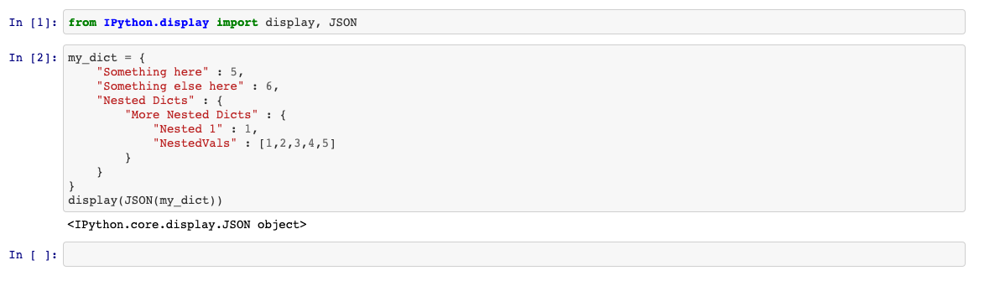
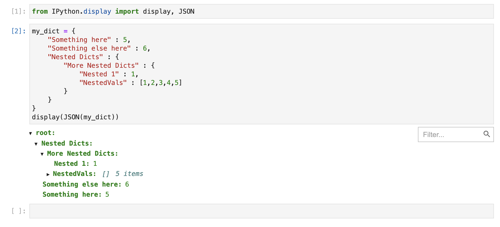

# IPYNB_Json_Example

Per [this StackOverflow question](https://stackoverflow.com/questions/65946583/json-styling-in-jupyter-lab-and-github),
currently the GitHub web app does not render Jupyer's built-in JSON viewer. Instead, it is displayed as the
text `<IPython.core.display.JSON object>`

`example.ipynb` is a notebook which demonstrates the issue. Load it up in the web viewer, and you will see the cell's
output rendered as follows:

When this same file is viewed through a local JupyerLab (or JupyterNotebook) instance, the JSON is correctly loaded,
however:

